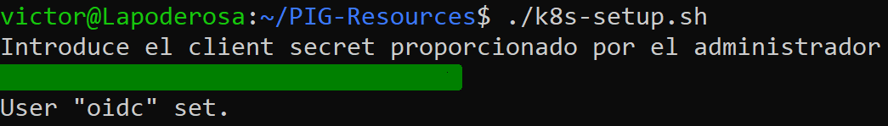
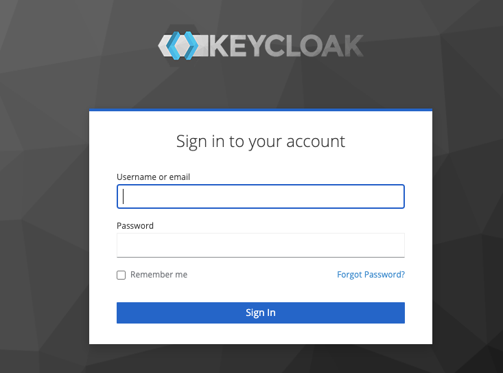
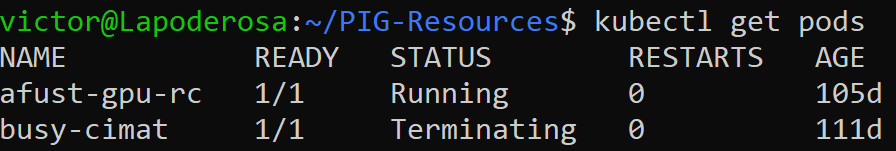

# Usando linux

## Instalación y configuración

Empezamos clonando el repositorio de *github* y entramos al directorio descargado

```bash
git clone https://github.com/CUDI-PIG/PIG.git
cd PIG-Resources
```

Ahora instalamos lo necesario corriendo el archivo `linux-setup.sh`

```bash
chmod +x linux-setup.sh
./linux-setup.sh
```
Con el primer comando lo hacemos ejecutable. Después, configuramos *kubernetes* ejecutando el archivo `k8s-setup.sh`

```bash
./k8s-setup.sh
```

Se nos pedirá una llave que nos dará el administrador del clúster, como se ve en la siguiente imagen

{ style="display: block; margin: 0 auto; width: 1000px;"}

!!! info "Importante"
    Para obtener la llave, favor de contactar al administrador del sistema de PIG.

Por último, agregamos la siguiente ruta de la herramienta de línea de comandos para *kubernetes*, llamada *krew*, al archivo `~/.bashrc` (configura nuestra *shell* de bash) 

```bash
export PATH="${KREW_ROOT:-$HOME/.krew}/bin:$PATH"
```

Al agregar el `PATH` recargamos la *shell*

```bash
source ~/.bashrc
```

Para verificar que la instalación y configuración fue exitosa, usaremos el siguiente comando

```bash
kubectl get pods
```

Al ejecutar el comando se abrirá una página nueva en su navegador predeterminado como la siguiente

{ style="display: block; margin: 0 auto; width: 1000px;"}

Donde deberá ingresar las credenciales de su cuenta en PIG proporcionadas por el administrador. Si la conexión fue exitosa en la terminal obtendrá el resultado del comando de *kubernetes*

{ style="display: block; margin: 0 auto; width: 1000px;"}

Este comando nos muestra los pods actuales en PIG.

!!! Success "Éxito"
    Si obtiene un resultado similar al de la imagen ¡¡Felicidades ya puede usar el clúster de PIG!!


