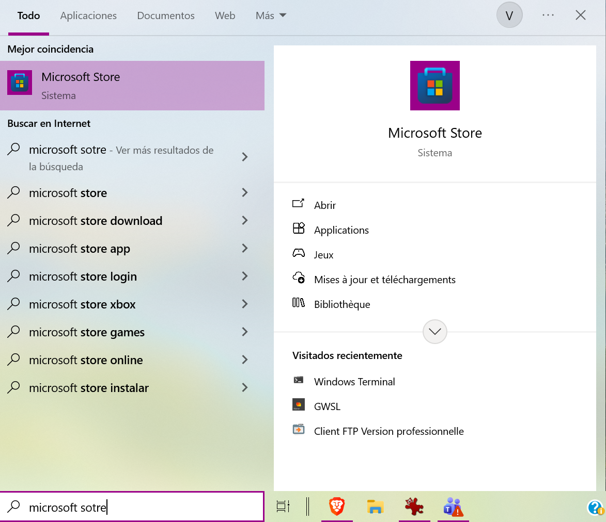
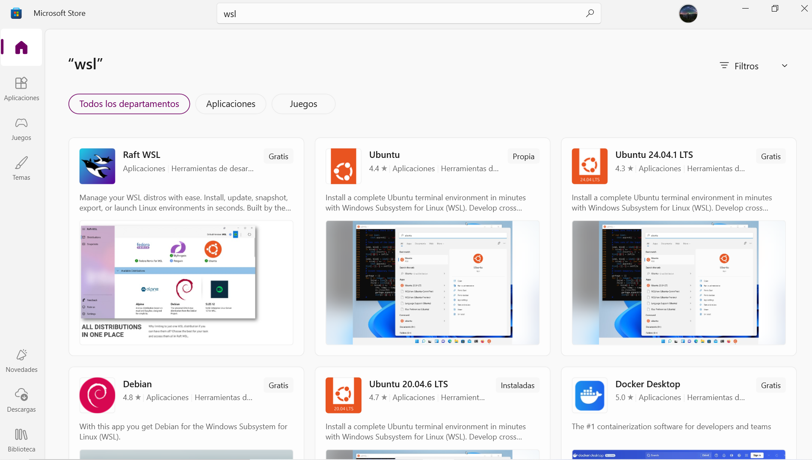
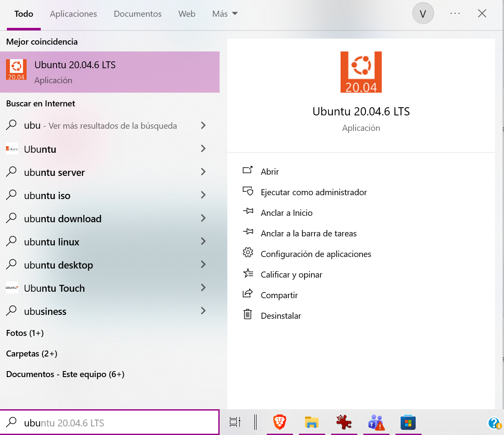
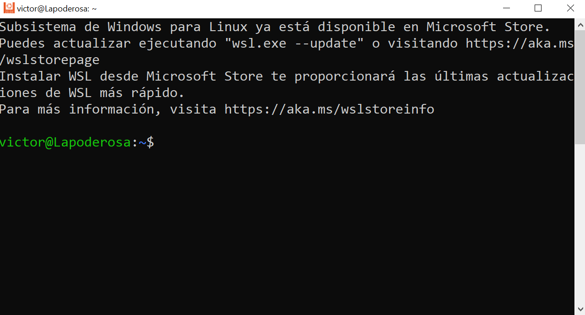
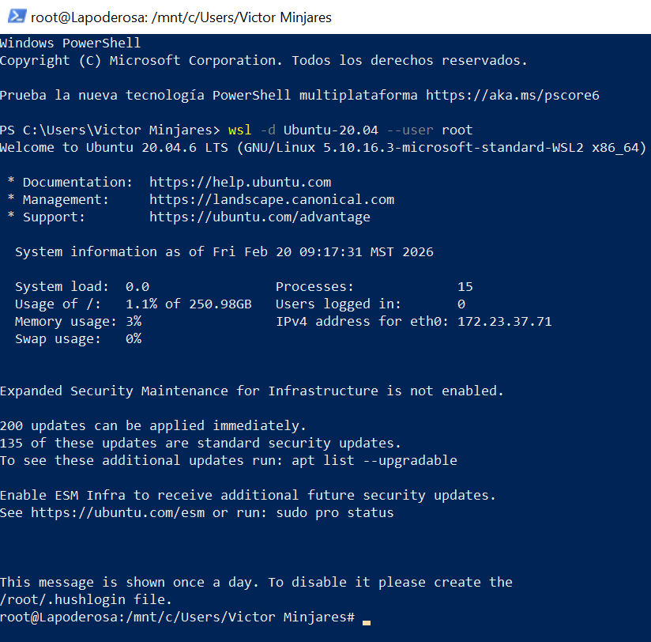
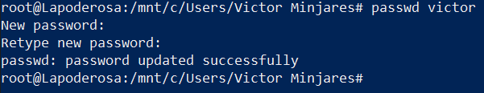

# Usando Windows

## Descargar terminal de GNU/Linux (WSL)

Para poder realizar este tutorial en Windows, primeramente debemos instalar un subsistema Linux en Windows. Este lo podemos encontrar en la *Microsoft store*. Ingresamos el nombre en el buscador de nuestro sistema operativo como se ve en la siguiente imagen

{ style="display: block; margin: 0 auto; width: 1000px;"}

Una vez abierto *Microsoft store*, ingresamos _wsl_ y nos saldran opciones de subsistemas Linux (distribuciones), se puede eligir el que prefiera el usuario

{ style="display: block; margin: 0 auto; width: 1000px;"}

Para instalar una distribución pasamos el ratón por encima de la distribución deseada y en la esquina derecha aparecera un boton para instalarla.  Al terminar la instalación podemos usar el buscador de Windows para encontrar nuestro _wsl_ instalado

{ style="display: block; margin: 0 auto; width: 1000px;"}

En este turorial usaremos la distribucion *Ubuntu 20.04.6 TLS*. Al abrirla, se les abrira una ventaja como la siguiente

{ style="display: block; margin: 0 auto; width: 1000px;"}


## Instalación y configuración

Con nuestra subsistema Linux _wsl_, procedemos a la instalación del cliente de *kubernetes* y su configuración.

Empezamos clonando el repositorio de *github* y entramos al directorio descargado

```bash
git clone https://github.com/supercomputo-CUDI/PIG.git
cd PIG-Resources
```

Ahora instalamos lo necesario corriendo el archivo `wsl-setup.sh`

```bash
chmod +x wsl-setup.sh
./wsl-setup.sh
```

Con el primer comando lo hacemos ejecutable.

!!! info "Importante"
    Se necesita tener privilegios de administrador para poder correr el archivo `wsl-setup.sh`, si no recuerda cuál es tu contraseña de administrador puede ver cómo hacerlo en la [sección de cambio de contraseña de administrador](#reset-pass).

Después, configuramos *kubernetes* ejecutando el archivo `k8s-setup.sh`

```bash
./k8s-setup.sh
```

Se nos pedirá una llave que nos dará el administrador del clúster, como se ve en la siguiente imagen

{ style="display: block; margin: 0 auto; width: 1000px;"}

!!! info "Importante"
    Para obtener la llave, favor de contactar al administrador de sistema de PIG.

Por último, agregamos la siguiente ruta de la herramienta de línea de comandos para *kubernetes*, llamada *krew*, al archivo `~/.bashrc` (configura nuestra *shell* de bash) 

```bash
export PATH="${KREW_ROOT:-$HOME/.krew}/bin:$PATH"
```

Al agregar el `PATH` recargamos la *shell*

```bash
source ~/.bashrc
```

Para verificar que la instalación y configuración fue exitosa, usaremos el siguiente comando

```bash
kubectl get pods
```

Al ejecutar el comando se abrirá una página nueva en su navegador predeterminado como la siguiente

{ style="display: block; margin: 0 auto; width: 1000px;"}

Donde deberá ingresar las credenciales de su cuenta en PIG proporcionadas por el administrador. Si la conexión fue exitosa en la terminal obtendrá el resultado del comando de *kubernetes*

{ style="display: block; margin: 0 auto; width: 1000px;"}

Este comando nos muestra los pods actuales en PIG.

!!! Success "Éxito"
    Si obtiene un resultado similar al de la imagen ¡¡Felicidades ya puede usar el clúster de PIG!!

## Cambiar constraseña de administrador (opcional) {: #reset-pass }

Para cambiar la contraseña de su usuario con privilegios de administrador en _wsl_, podemos hacerlo desde la terminal *Windows PowerShell*, la cual ya esta instalada en *Windows* por predeterminado. En la terminal ejecutamos el comando

```powershell
wsl -d Ubuntu-20.04 --user root
```
En este caso, entramos a la distribución `Ubunut-20.04` ya que fue la que instalamos, usted pondra la distribución _wsl_ que use. Al hacerlo verá que su usuario cambiará a `roor` como en la imagen

{ style="display: block; margin: 0 auto; width: 1000px;"}

Por último, cambiamos la contraseña de nuestro usuario, en mi caso es `victor`, como se ve a continuación

{ style="display: block; margin: 0 auto; width: 1000px;"}

Con esto ya podremos ejecutar los archivos usando esta nueva contraseña.


