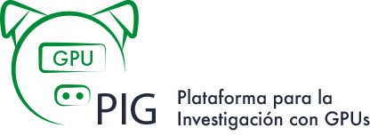

# Plataforma para la Investigación con GPUs

[//]: # ({ style="display: block; margin: 0 auto; width: 500px; border-radius: 10px" })

### Un proyecto de colaboración interinstitucional de la Comunidad de Supercómputo de CUDI

---

{ style="display: block; margin: 0 auto; width: 500px; background-color: white; padding: 20px; border-radius: 10px" }

La Plataforma para la Investigación con GPUs (PIG) es un proyecto de colaboración interinstitucional de la Comunidad de Supercómputo en la Corporación Universitaria para el Desarrollo de Internet (**CUDI**).

Su principal objetivo es agrupar infraestructura de GPUs distribuida en diferentes instituciones miembros de la **Red Nacional de Educación e Investigación (RNEI) Mexicana**, bajo una misma plataforma basada en contenedores que permita compartir recursos de manera segura y sencilla.

## Infraestructura disponible en PIG

| Instituciones | GPUs | Nodo | Nvidia Driver | Max CUDA | Modelo |
| :---: | :---: | :---: | :---: | :---: | :---: |
| UAEMEX | 4 | mandra-node-gpu | 470.256 | 11 | GeForce GTX 780 |
| UNAM | 1 | tochitl | 560.35.03 | 12.6 | RTX A5000 |
| UNAM | 1 | atocatl | 550.54.15 | 12.4 | GeForce RTX 4070 Ti |
| UNAM | 1 | atocatl | 550.54.15 | 12.4 | GeForce RTX 3070 Ti |
| CIMAT | 1 | n-gpu01 | 470.256.02 | 11 | Tesla K40c |
| UNISON | 4 | acarus-nvidiav100 | 470.256.02 | 12.4 | Tesla V100-SXM2-32GB |
